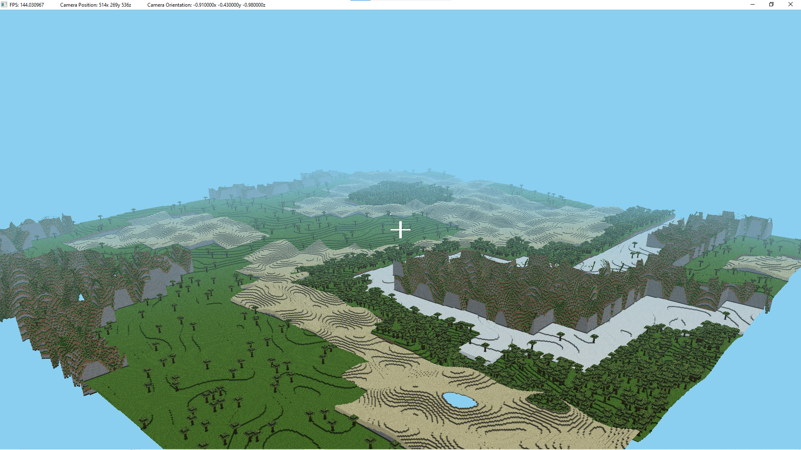

## This repository holds a fork of my minecraft openGL clone!
This repository will also be used for tutorial videos - feel free to also take a fork of this repository and do with it as you like (including making your own game engine fork!), although please credit me if you do - as the repository is under the MIT X license!

#### Building Note 
Note this repository is defacto built using VSCode's c++ tools - so it uses the tasks.json file in the .vscode folder. By default the tasks.json there is for windows using clang++, but there is also a version for MacOS in the misc folder. Just switch them if needed, putting the macos mac_tasks.json in the .vscode folder and renaming it to tasks.json. The Windows version also use Clang++ so make sure you have clang-cl installed. 

Overall, you need these installed:
- [Clang-CL](https://www.youtube.com/watch?v=tVZB_L2SuFw) compiler if using Windows (This is the Clang++ Command)
- GCC compiler if using MacOS 
- VScode needs to be installed
    - C++ extension for VSCode

#### Shortcut commands for building in vscode: 
- command+shift+b to build c++ code
- type ./app in terminal to run the compiled code

#### Any Questions ~ 
Feel free to ask me on youtube! https://www.youtube.com/@Finding_Fortune/videos

### Resources
- Check the misc folder for examples on how to do [vertex compression](https://www.youtube.com/watch?v=d10MOYtNXB4) 
- The WorldConstants.hpp file has all of the settings for the world, including amount of chunks generating and similar things

